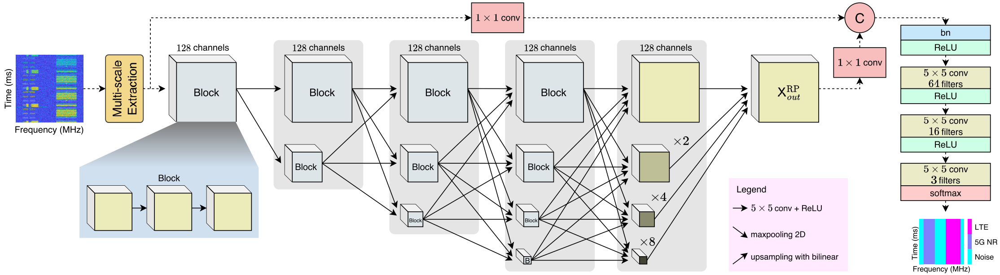
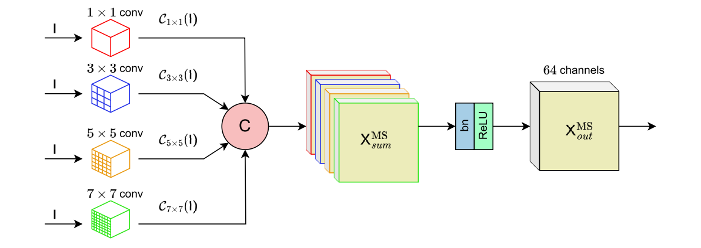

# Resolution-Preserving Multi-Scale Network for 5G-LTE Spectrogram-based Spectrum Sensing

Spectrum sensing is crucial in cognitive radio networks for dynamic spectrum management in heterogeneous wireless communications. Recent advances in machine learning, particularly deep learning, have enhanced spectrum sensing by enabling signal identification in shared-spectrum networks like 5G NR and LTE.
However, all current models process spectrograms at reduced resolutions via a downsampling procedure in encoders, leading to a loss of finer spectral features (e.g., detailed characteristics of narrowband signals) and spatial details for fine-grained segmentation of wider-band signals (e.g., overlapping components in LTE signals or those at low SNR).

To address the aforementioned issues, we propose PRMNet, an advanced deep learning model specifically designed for segmenting 5G and LTE signals in spectrograms derived from STFT to capture both frequency and time domain characteristics. 
PRMNet employs a resolutionpreserving architecture to maintain the original spectrogram resolution while effectively extracting fine spectral features across multiple scales without losing critical information. Additionally, a multi-scale feature extraction (MSFE) module is employed to capture intricate details and broader contextual information, thereby enhancing the learning efficiency of complex 5G-LTE spectral patterns under noisy conditions and channel impairments.

The Python code and dataset provided here are included in the early access version of the paper in IEEE Wireless Communications Letters.

Huu-Tai Nguyen, Hai-Trang Phuoc Dang, Quoc-Viet Pham, and Thien Huynh-The, "Resolution-Preserving Multi-Scale Network for 5G-LTE Spectrogram-Based Spectrum Sensing,"  in IEEE Wireless Communications Letters, doi: 10.1109/LWC.2025.3552193, March 2025. [[Link](https://ieeexplore.ieee.org/abstract/document/10930430)]

The dataset can be downloaded from [Kaggle](https://www.kaggle.com/datasets/huutai23012003/spectrogramdata-new/data). Please report if it is not available.

If there are any errors or topics that need to be discussed, please contact [Huu-Tai Nguyen](https://github.com/HuuTaiNg) via email at n.huutai231@gmail.com.
